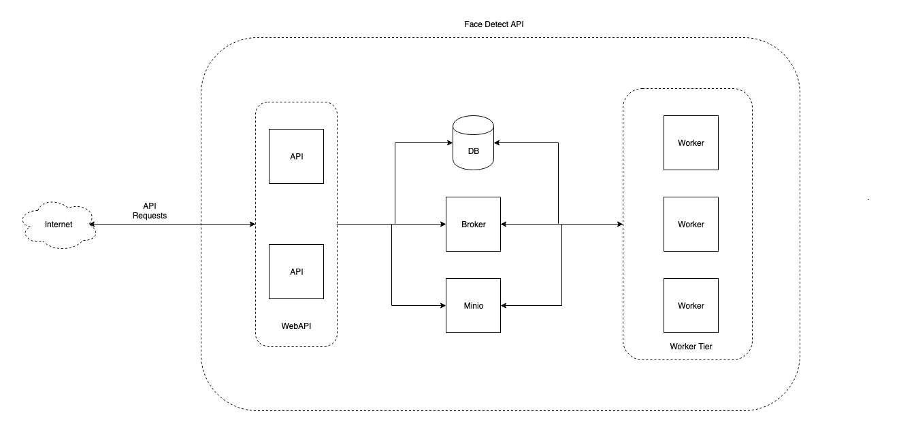
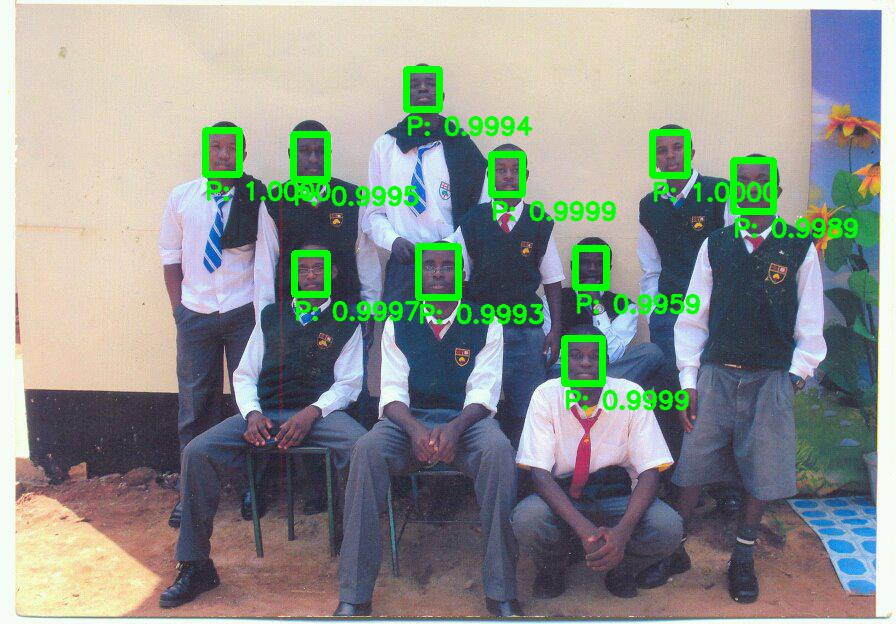

# Face Detect API

[](https://codeclimate.com/github/urandu/face_detect_api/maintainability) 

This is a production-ready face detection API that takes an image as input and returns detected faces with high accuracy. Built with modern technologies and upgraded to the latest versions for better performance and security.

## 🚀 Recent Updates
- **Django 5.0.7** - Upgraded from Django 2.2.28 for better performance and security
- **Python 3.11** - Updated runtime for improved performance
- **Modern Dependencies** - All packages updated to latest compatible versions
- **Enhanced Security** - Latest security patches and improvements

## 🛠️ Technologies Used
- **Django 5.0.7** - Web framework
- **Django REST Framework 3.15.1** - API framework
- **TensorFlow 2.16.2** with MTCNN model - Face detection
- **Celery 5.3.4** - Asynchronous task processing
- **PostgreSQL** - Database
- **MinIO** - Object storage
- **RabbitMQ** - Message broker
- **Redis** - Task result backend
- **Docker** - Containerization

## Architecture

The architecture uses a microservice design with asynchronous processing for scalability and performance.



## 📋 Requirements

- **Python**: 3.8+ (recommended: 3.11)
- **Docker** and **Docker Compose**
- **PostgreSQL**: 11+
- **Redis**: 5+
- **RabbitMQ**: 3.6+

## 🚀 Quick Start

### Local Deployment

1. **Clone the repository**
   ```bash
   git clone https://github.com/urandu/face_detect_api.git
   cd face_detect_api
   ```

2. **Start services with Docker Compose**
   ```bash
   docker-compose up -d
   ```

3. **Run database migrations**
   ```bash
   docker-compose run api python manage.py makemigrations
   docker-compose run api python manage.py migrate
   ```

4. **Create admin user (optional)**
   ```bash
   docker-compose run api python manage.py createsuperuser
   ```

5. **Validate the upgrade (if upgrading from older version)**
   ```bash
   ./validate_upgrade.sh
   ```

- To test our API, we shall send a post request to the endpoint `http://localhost:8900/api/image/`

 ```
curl -i -X POST -H "Content-Type: multipart/form-data" 
-F "request_id=12345" -F "callback_url=<replace with requestbin.com endpoint>" -F "image=<path to image>" http://localhost:8900/api/image/

> Note: requestbin.com may be unreliable. https://webhook.site is a good alternative for testing callback_url locally.
```
- callback response
```
{
    "image_id": "0a5a49c6-18dc-4b3a-b984-70476280aa13",
    "request_id": "123456789",
    "faces": [
        {
            "confidence": "0.9999778270721436",
            "box": "[205, 130, 34, 44]",
            "keypoints": "{'left_eye': (216, 146), 'right_eye': (233, 148), 'nose': (224, 157), 'mouth_left': (216, 165), 'mouth_right': (230, 166)}"
        },
        {
            "confidence": "0.9999626874923706",
            "box": "[652, 132, 35, 43]",
            "keypoints": "{'left_eye': (662, 151), 'right_eye': (678, 148), 'nose': (670, 156), 'mouth_left': (666, 167), 'mouth_right': (679, 165)}"
        },
        {
            "confidence": "0.9999274015426636",
            "box": "[564, 338, 38, 45]",
            "keypoints": "{'left_eye': (576, 355), 'right_eye': (595, 355), 'nose': (586, 364), 'mouth_left': (577, 374), 'mouth_right': (593, 374)}"
        },
        {
            "confidence": "0.9998524188995361",
            "box": "[491, 154, 31, 40]",
            "keypoints": "{'left_eye': (501, 170), 'right_eye': (516, 170), 'nose': (509, 177), 'mouth_left': (502, 186), 'mouth_right': (515, 186)}"
        },
        {
            "confidence": "0.9997138381004333",
            "box": "[294, 253, 33, 41]",
            "keypoints": "{'left_eye': (303, 269), 'right_eye': (319, 267), 'nose': (310, 277), 'mouth_left': (304, 285), 'mouth_right': (319, 284)}"
        },
        {
            "confidence": "0.9995110034942627",
            "box": "[293, 134, 34, 45]",
            "keypoints": "{'left_eye': (304, 150), 'right_eye': (321, 151), 'nose': (313, 161), 'mouth_left': (305, 168), 'mouth_right': (320, 169)}"
        },
        {
            "confidence": "0.999414324760437",
            "box": "[406, 69, 33, 40]",
            "keypoints": "{'left_eye': (414, 83), 'right_eye': (431, 82), 'nose': (423, 89), 'mouth_left': (417, 100), 'mouth_right': (431, 99)}"
        },
        {
            "confidence": "0.9993127584457397",
            "box": "[418, 246, 40, 51]",
            "keypoints": "{'left_eye': (429, 265), 'right_eye': (449, 266), 'nose': (438, 275), 'mouth_left': (430, 286), 'mouth_right': (446, 287)}"
        },
        {
            "confidence": "0.9989363551139832",
            "box": "[733, 160, 40, 51]",
            "keypoints": "{'left_eye': (743, 180), 'right_eye': (763, 180), 'nose': (751, 189), 'mouth_left': (744, 200), 'mouth_right': (761, 200)}"
        },
        {
            "confidence": "0.995890200138092",
            "box": "[575, 248, 31, 39]",
            "keypoints": "{'left_eye': (585, 262), 'right_eye': (601, 262), 'nose': (593, 269), 'mouth_left': (585, 277), 'mouth_right': (598, 278)}"
        }
    ],
    "output_image_url": "localhost:8900/api/image/?image_id=0a5a49c6-18dc-4b3a-b984-70476280aa13"
}
```

## 📷 Example Results

### Input Image


### Output Image


## 📚 Documentation

- **[Django 5.0 Upgrade Guide](./DJANGO_UPGRADE_GUIDE.md)** - Detailed upgrade documentation
- **[API Documentation](http://localhost:8900/swagger/)** - Swagger/OpenAPI docs (when running)
- **[Medium Article](https://medium.com/@urandu/build-a-production-ready-face-detection-api-part-1-c56cbe9592bf)** - Development deep dive

## 🔧 Development

### Upgrading from Previous Versions

If you're upgrading from Django 2.2, see the **[Django 5.0 Upgrade Guide](./DJANGO_UPGRADE_GUIDE.md)** for detailed instructions.

### Running Tests

```bash
docker-compose run api python manage.py test
```

### Development Setup

```bash
# Install dependencies
pip install -r requirements.txt

# Run development server
python manage.py runserver

# Run Celery worker
celery -A api.celery_app worker --loglevel=info
```

## 🚀 Production Deployment

### Quick Production Deployment

1. **Copy and configure environment**
   ```bash
   cp .env.prod.template .env
   # Edit .env with your production values
   ```

2. **Deploy with the deployment script**
   ```bash
   ./deploy.sh --build
   ```

3. **Check deployment status**
   ```bash
   ./deploy.sh --status
   ```

### Manual Production Deployment

```bash
# Deploy to production
docker-compose -f docker-compose.prod.yml up -d --build

# Run migrations
docker-compose -f docker-compose.prod.yml exec api python manage.py migrate

# Create admin user
docker-compose -f docker-compose.prod.yml exec api python manage.py createsuperuser

# Check status
docker-compose -f docker-compose.prod.yml ps
```

### Production Features

- **Multi-stage Docker builds** for optimized images
- **Nginx reverse proxy** with SSL support
- **Health checks** for all services
- **Security hardening** (non-root containers, security headers)
- **Rate limiting** and request size limits
- **Automated service dependencies** and health monitoring
- **Horizontal scaling** support

For detailed production deployment instructions, see **[PRODUCTION_DEPLOYMENT.md](./PRODUCTION_DEPLOYMENT.md)**.

### Kubernetes Deployment

The application also includes Kubernetes manifests in `devops/deploy/k8/` for production deployment.

## 📄 License

This project is licensed under the LGPL-3.0 License.
